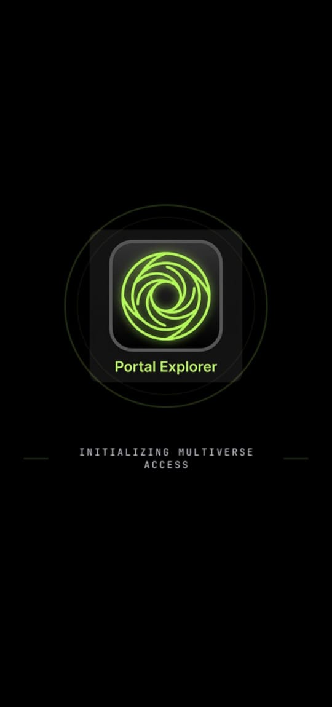
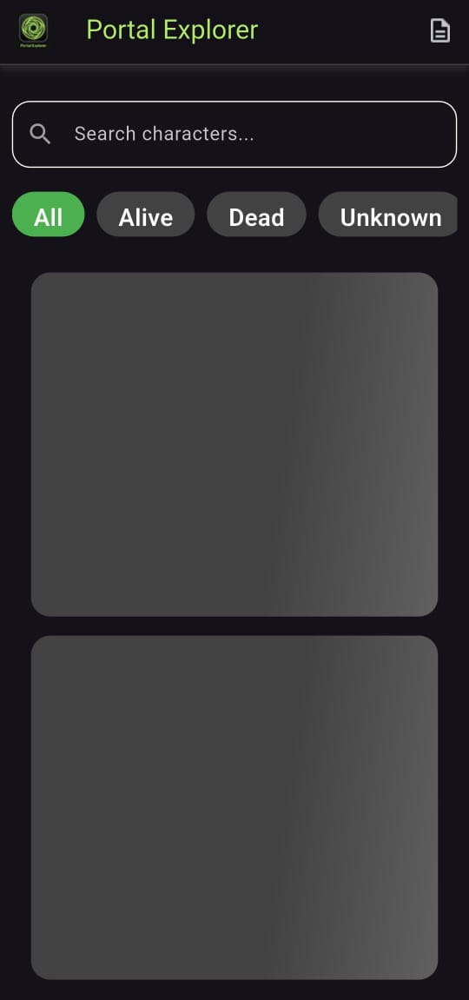
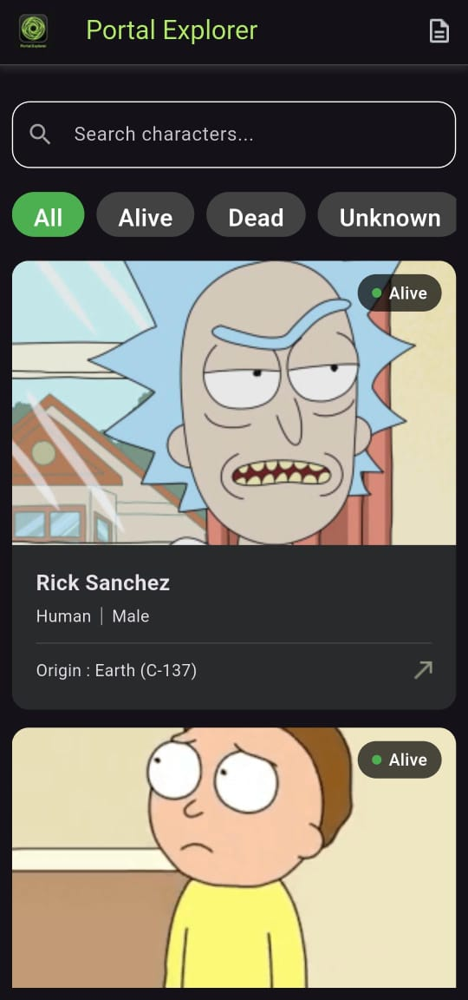
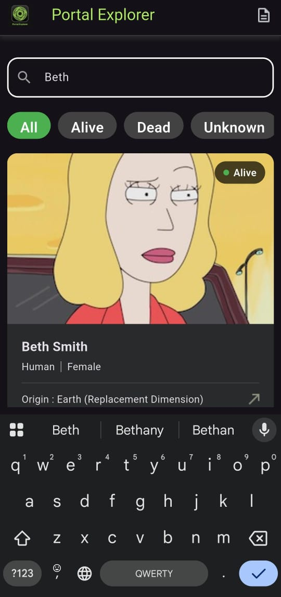
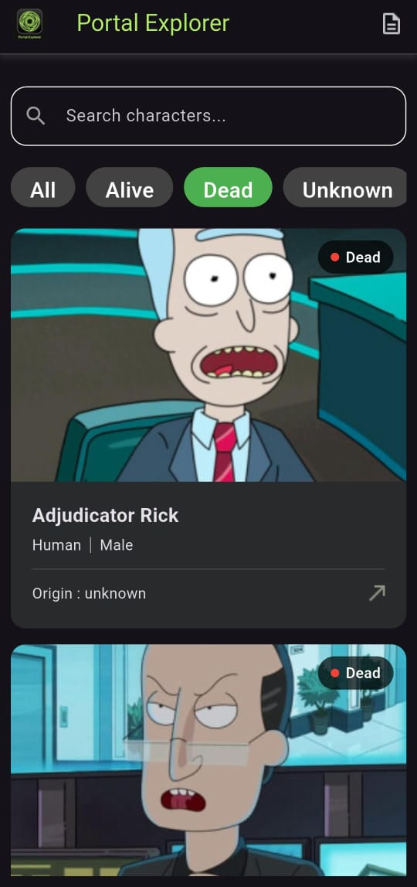
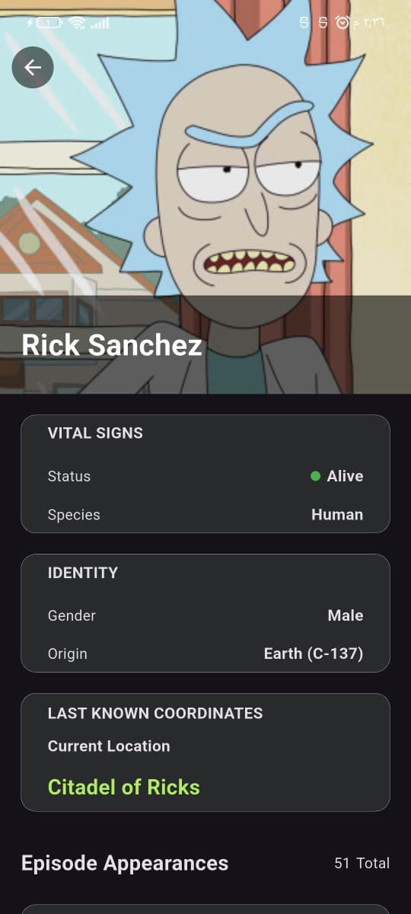
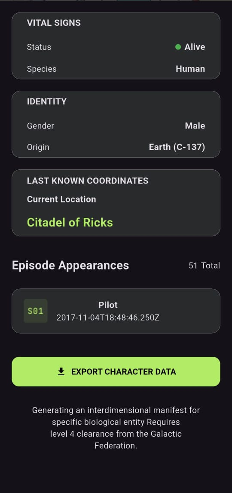
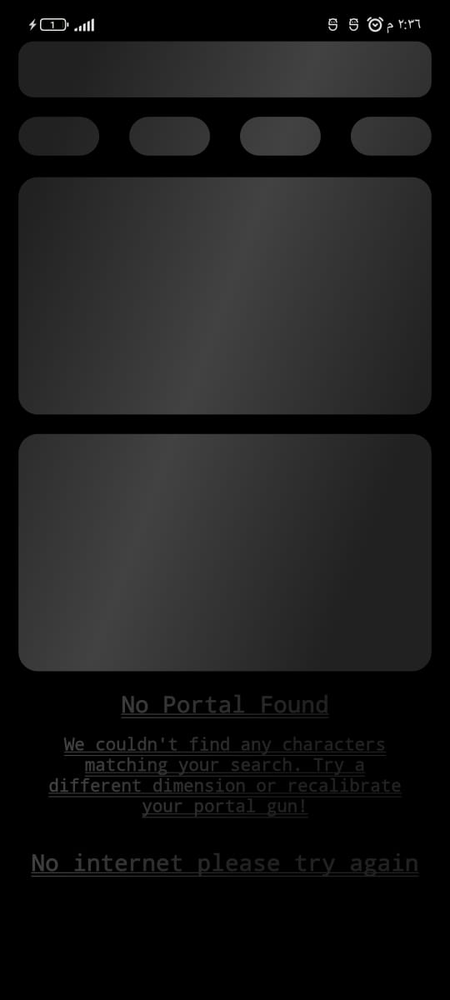

# Rick and Morty App

A Flutter application that displays characters from the Rick and Morty API using Clean Architecture and BLoC for state management. The app provides a smooth and responsive user experience with search, filtering, internet connectivity handling, shimmer loading, and Excel export functionality.

## ✨ Features

- Display all Rick and Morty characters.
- Splash Screen.
- Shimmer Loading.
- Character Details Screen.
- Search Characters by Name.
- Filter Characters.
- Internet Connection Handling.
- Export Character Details to an Excel File.
- Responsive UI for Different Screen Sizes.

---

## 📱 Screenshots

### 🚀 Splash Screen
The application starts with a clean splash screen before navigating to the main content.

---

### ✨ Shimmer Loading
Displays a smooth shimmer loading effect while fetching data from the API to improve the user experience.

---

### 🏠 Home Screen
Displays all characters in a responsive grid with smooth scrolling.

---

### 🔍 Search Screen
Search for characters instantly by typing their names.

---

### 🎯 Filter Screen
Filter characters based on the available categories.

---

### 👤 Character Details Screen
Shows detailed information about the selected character, including image, status, species, gender, and origin.

---

### 📄 Export to Excel
Export the selected character's information to an Excel file and save it on the device.

---

### 📡 No Internet Screen
Displays a dedicated screen when there is no internet connection and automatically returns to the previous screen once the connection is restored.

---

## 🛠️ Tech Stack

- Flutter
- Dart
- Clean Architecture
- BLoC
- Dio
- GetIt
- Equatable
- Flutter ScreenUtil
- Shimmer
- Connectivity Plus
- Excel

---

## 📦 API

*Rick and Morty API*

https://rickandmortyapi.com/

---

## 📂 Project Structure

text
lib/
├── core/
├── data/
├── domain/
└── presentation/

Following *Clean Architecture* principles:

- *Data Layer* – API, Models, Repository Implementation.
- *Domain Layer* – Entities, Repository Contracts, Use Cases.
- *Presentation Layer* – UI, BLoC, States, and Events.

---

## 👨‍💻 Developer

*Ahmed Abo Khalil*